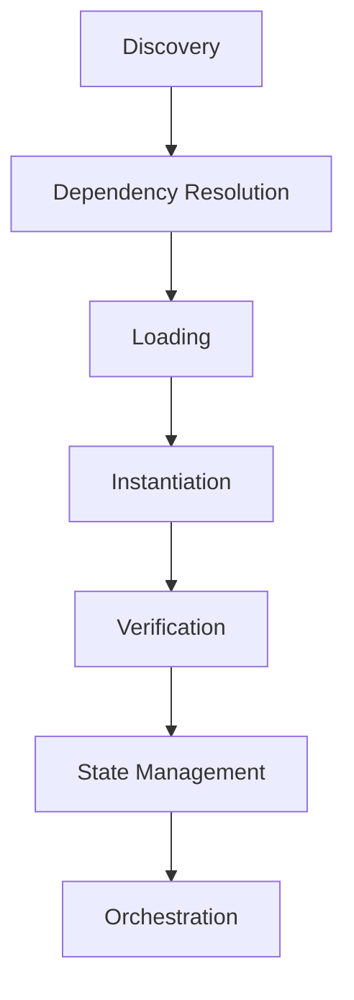

# Nizaami Plugin System Architecture

## Overview

The Nizaami Plugin System is a comprehensive, NestJS-based plugin architecture that provides a secure, scalable platform for dynamically loading and managing plugins. The system follows a modular design with clear separation of concerns across discovery, loading, orchestration, and security layers.

## Core Components

### 1. Plugin Core Library (`libs/plugin-core`)

The central plugin system containing all core functionality:

#### Discovery Layer

- **PluginDiscoveryService**: Discovers plugins in configured search paths
- Supports both legacy and modern manifest formats
- Validates plugin manifests before loading

#### Loading Layer

- **PluginLoaderService**: Core plugin loading functionality
- **DefaultPluginLoaderStrategy**: Default loading implementation
- **ParallelLoadingStrategyService**: Parallel plugin loading support
- **DynamicPluginModuleGeneratorService**: Dynamic NestJS module creation

#### Coordination Layer

- **PluginLoaderCoordinatorService**: Orchestrates plugin loading with dependency resolution
- Manages loaded plugin instances
- Handles dependency ordering and conflict resolution

#### Orchestration Layer

- **PluginOrchestratorService**: Manages plugin lifecycle states
- Handles start/stop/restart operations
- Provides state change notifications

#### Lifecycle Management

- **PluginStateManagerService**: Tracks plugin states
- **PluginInstantiationService**: Handles plugin instantiation
- **PluginPostLoadVerificationService**: Post-load validation

#### Security Layer

- **PluginSecurityManagerService**: Security policy enforcement
- **PluginMemoryManagerService**: Memory monitoring and management
- **PluginDependencyResolverService**: Dependency resolution with security checks

### 2. Plugin Host Application (`apps/plugin-host`)

The main NestJS application that hosts plugins:

- Configures the plugin system with security settings
- Sets search paths for plugin discovery
- Enables features like parallel loading and memory monitoring
- Provides RESTful API endpoints (port 3000 by default)

### 3. Plugin Tooling (`tools/plugin`)

Nx plugin providing development tools:

#### Executors

- **build**: TypeScript compilation with asset copying
- **lint**: ESLint execution with auto-fix support
- **zip**: Distribution package creation

#### Generators

- **with-manifest-only**: Complete plugin project scaffolding

## Plugin Lifecycle

### States

1. **UNLOADED**: Plugin not loaded
2. **LOADING**: Plugin being loaded
3. **LOADED**: Plugin loaded but not running
4. **RUNNING**: Plugin active and running
5. **STOPPED**: Plugin stopped but still loaded
6. **ERROR**: Plugin in error state
7. **UNLOADING**: Plugin being unloaded

## Security Model

### Sandboxing

- Configurable plugin sandboxing
- Resource limits (memory, CPU, file descriptors)
- Permission-based access control

### Trust Levels

- **Trusted**: Full system access
- **Unverified**: Limited permissions
- **Restricted**: Minimal access

### Permissions

- Service access permissions
- Module access permissions
- Cross-plugin communication controls

## Configuration Architecture

### Core Configuration (`PluginCoreConfig`)

- Search paths for plugin discovery
- Auto-start behavior
- Memory monitoring settings
- Default timeouts and retries
- Parallel loading configuration
- Security policies

### Security Configuration (`PluginSecurityConfig`)

- Sandboxing enablement
- Default permissions
- Trusted plugin lists

### Resource Limits (`DefaultResourceLimits`)

- Memory limits
- CPU time limits
- File descriptor limits

## Data Flow

1. **Discovery**: Search configured paths for plugin manifests
2. **Validation**: Validate manifest structure and security requirements
3. **Dependency Resolution**: Resolve and order plugin dependencies
4. **Loading**: Load plugins according to resolved order
5. **Instantiation**: Create plugin instances and NestJS modules
6. **Verification**: Post-load security and functionality checks
7. **Orchestration**: Manage runtime plugin lifecycle
8. **Monitoring**: Track memory usage and performance metrics

## Extension Points

### Custom Loading Strategies

Implement `PluginLoaderStrategy` interface for custom loading behavior.

### Security Policies

Extend security services for custom permission models.

### State Management

Custom state transitions and lifecycle hooks.

### Discovery Mechanisms

Custom plugin discovery beyond filesystem scanning.

## Performance Considerations

- **Parallel Loading**: Configurable parallel plugin loading
- **Memory Monitoring**: Real-time memory usage tracking
- **Resource Limits**: Configurable resource constraints
- **Lazy Loading**: Plugins loaded on-demand
- **State Caching**: Efficient state management with minimal overhead
